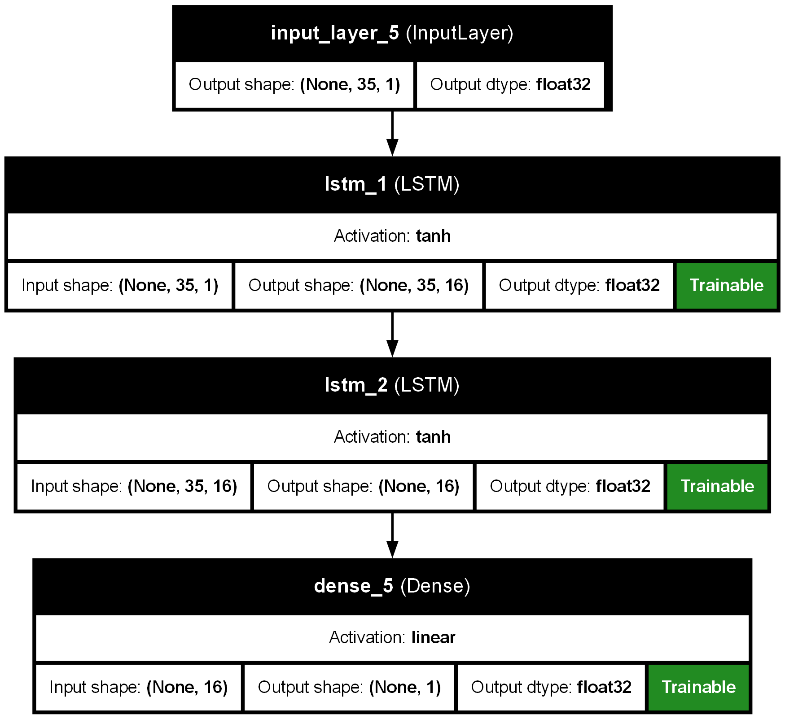
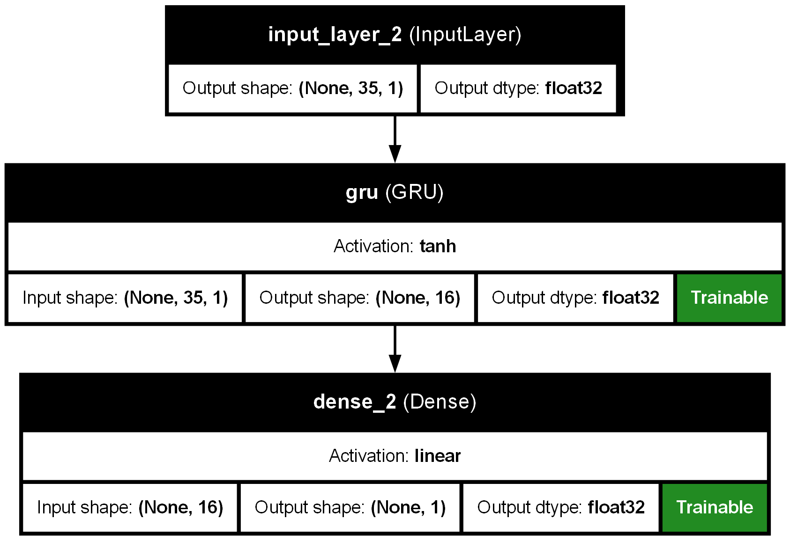
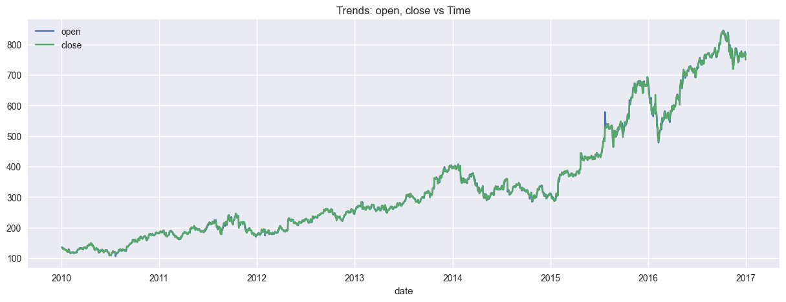
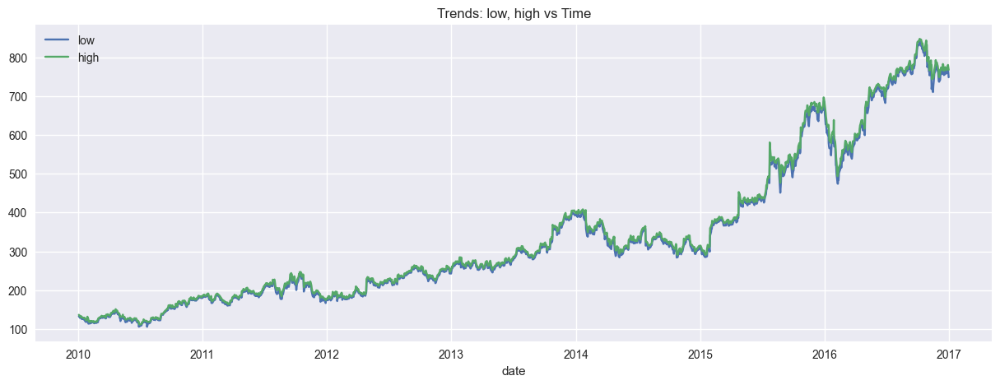
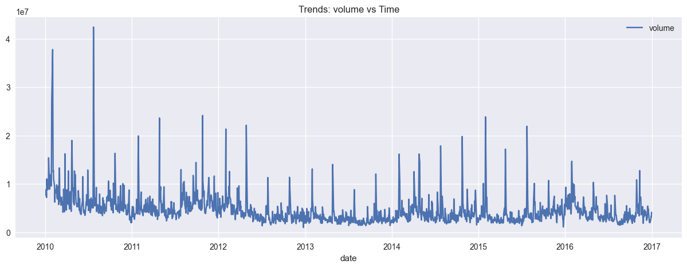

# 📈 Time Series Stock Price Prediction using RNNs

This project aims to predict stock prices using various RNN-based architectures including SimpleRNN, LSTM, and GRU, both shallow and deep. The dataset used includes historical price data for multiple stocks, with a specific focus on Amazon (`AMZN`).

---

## 🧰 1. Library Imports

The following libraries are used for:

* **Data Handling**: `numpy`, `pandas`
* **Visualization**: `matplotlib`, `seaborn`
* **Preprocessing & Modeling**: `sklearn`, `tensorflow/keras`
* **Utilities**: `os`, `math`, `pickle`, `re`

---

## 📁 2. Dataset Import and Exploration

* Read data from `prices.xlsx`.
* Inspect dataset structure with `.head()`, `.tail()`, `.info()`, `.describe()`.
* Count how many entries exist for each stock symbol.

---

## 🧹 3. Data Preprocessing

### Type Casting:

* Ensure correct data types:

  * **Numerical**: `open`, `close`, `low`, `high`, `volume`
  * **Categorical**: `symbol`
  * **Datetime**: `date`

### Stock Selection:

* Filter the dataset to include only Amazon (`AMZN`) data.
* Drop the symbol column.

### Sorting:

* Sort records by time to preserve temporal order.

### Nulls & Duplicates:

* Check for missing or duplicated entries.

---

## 📊 4. Data Visualization

* Plot time trends of `open`, `close`, `low`, `high`, and `volume` to visually assess trends over time.
* Use **boxplots** to detect outliers.

---

## 📦 5. Outlier Handling

* `IQR()` method is defined for optional clipping of outliers.
* Outlier removal is commented out but provided for experimentation.

---

## 🛠️ 6. Feature Engineering

Currently **not implemented**, but placeholder exists for future feature creation (like lag features, moving averages, etc.).

---

## 🔗 7. Correlation Analysis

* Visualize correlation matrix to detect redundant or irrelevant features.
* Drop low-informative or highly correlated features: `open`, `low`, `high`, `volume`.

---

## 🧮 8. Encoding & Scaling

* Drop time columns before scaling.
* Use **MinMaxScaler** to normalize numerical input features to \[0,1].

---

## 📚 9. Train Dataset Preparation

* Use a sliding window (`WINDOW_SIZE = 35`) to form training samples.
* `X`: input sequences, each of length 35 time steps.
* `y`: corresponding target value (next time step’s `close` price).
* Split into training and testing sets (70/30 split).

---

## 🧠 10. Model Architecture

Define and train 6 deep learning models:

| Model Name     | Architecture      |
| -------------- | ----------------- |
| `shallow_rnn`  | SimpleRNN + Dense |
| `deep_rnn`     | 2-layer SimpleRNN |
| `shallow_gru`  | GRU + Dense       |
| `deep_gru`     | 2-layer GRU       |
| `shallow_lstm` | LSTM + Dense      |
| `deep_lstm`    | 2-layer LSTM      |

Each model is wrapped in a `CustomModel` class for:

* Training
* Caching (saving/loading)
* Predictions on train/test
* History tracking

Model weights and training history are saved in `/models_cache`.

---

## 🏋️ 11. Model Training

* All models are trained using `fit()` with early stopping and checkpointing.
* Epochs = 100, Validation Split = 0.1
* If a cached version exists, it is loaded instead of retraining.

---

## 📉 12. Training History Visualization

* Plot loss curves (train vs. validation) for each model to monitor training progress.

---

## 🧪 13. Evaluation

* Predict on both train and test sets.
* Calculate `MSE` and `MAE`.
* Compare all models in a bar chart for each metric.

---

## 📈 14. Visualize Predictions

* Plot actual vs. predicted values for both training and testing periods for each model.

---

## 🧬 15. Model Architecture Visualization

* Visualize model architecture using `plot_model()` from Keras.
* Images are saved to `models_arch/`.

---

## 💾 16. Caching and Saving Outputs

### 🔹 Evaluation Data

* Evaluation metrics are saved to `eval_dataset.csv`.

### 🔹 Predictions

* Actual vs. predicted values are saved to `models_predictions/` as CSV.

### 🔹 Scalers

* Save `MinMaxScaler` to `encoders_scalers/min-max.pickle` for later reuse or inference.

---

## 🧩 17. Utility Functions

### `save_obj()` / `load_obj()`:

* Save or load Python objects using `pickle`.

---

## 📎 Future Improvements

* Implement feature engineering (e.g. lag features, rolling averages).
* Add hyperparameter tuning and grid search.
* Experiment with attention mechanisms or Transformer-based models.
* Integrate cross-validation for more robust evaluation.

---

## 📌 Project Structure

```text
📂models_cache/
📂models_predictions/
📂models_arch/
📂encoders_scalers/
📄prices.xlsx
📄eval_dataset.csv
📄README.md
```

---

## ✅ Requirements

Make sure you have these Python libraries installed:

```bash
pip install numpy pandas matplotlib seaborn scikit-learn tensorflow
```

---

## 🚀 Live Demo
Check out the live version (if hosted on Streamlit Cloud or similar):
[👉 Live App Demo](https://your-deployment-link.com)

### 🖼️ Example Prediction

> Predicting the next closing stock price for Amazon based on the past 35 days:

* Input Sequence (Scaled):
  `[0.52, 0.54, 0.55, ... 0.61]`
* Predicted Close Price:
  `0.635` *(min-max scaled) → reverse transform if needed*

---

## 🖼️ Model Architecture Images

Visual representations of each model are saved under `models_arch/`.

Here are a few examples:

### ✅ `shallow_rnn`


### ✅ `deep_lstm`



### ✅ `shallow_gru`



Each diagram shows:

* Input shape
* Recurrent layers (RNN / GRU / LSTM)
* Dense output layer
* Parameter count and shapes

---

## 🖼️ Trends





---